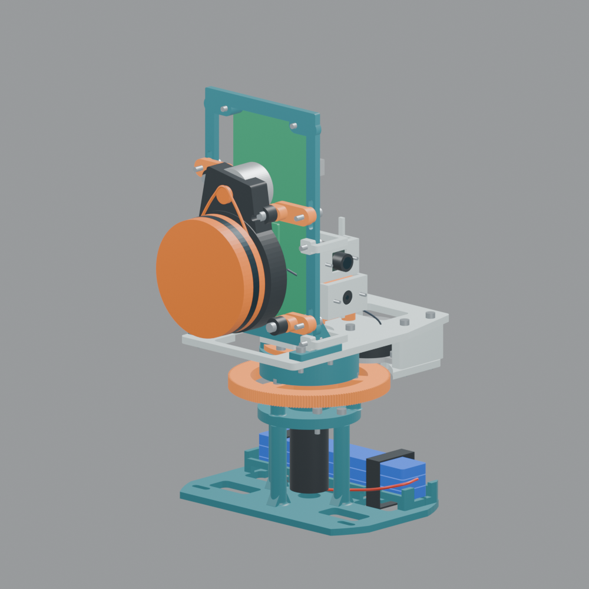

# Diagnóstico do scanner: ângulos, movimento e UWB

Revisão de 22/09/2026. Foram lidos os dois firmwares, o aplicativo Unity, `tcc.net`, `tccvis.net`, as seis imagens e os dois arquivos Blender enviados. Os arquivos Blender foram abertos sem execução automática, inventariados e o conjunto montado foi renderizado. Os originais não foram alterados.

**Atualização de 23/09:** veja o [diagnóstico das novas capturas e roteiro de teste](diagnostico-novas-capturas.md). O usuário confirmou câmera no flat da S3-CAM e scanner/pessoa parados nas novas coletas. Há novos diagnósticos UWB, teste de eixo parado, marcação da origem AR e um perfil RGB isolado. O yaw de montagem atual foi preservado em 0° dos ensaios recentes; os 90° indicados pelo modelo abaixo continuam uma referência nominal a conferir.

**Resultado:** existem erros de escala angular, geometria e temporização confirmados no software. Foram corrigidos e testados os caminhos descritos abaixo. **O funcionamento com scanner e visualizador se movendo livremente ainda não está resolvido nem validado.** Exige calibração física, orientação completa e sincronização entre dispositivos; a disposição atual dos UWB também limita fortemente a precisão. Compilar o código não demonstra que esses requisitos foram atendidos.

O autor confirmou uma tag UWB e a MPU6050 na PCB do scanner, três âncoras no visualizador e movimento livre dos dois aparelhos. Não confirmou os eixos da MPU, os jumpers do driver ou que a montagem física já corresponde à transmissão do modelo. Os valores mecânicos abaixo são um **perfil nominal do modelo V2**, não calibração da unidade real.

## 1. Por que a nuvem pode formar círculos e espirais

| Falha encontrada | Efeito | Alteração realizada |
|---|---|---|
| Firmware usava `200 × 16 = 3.200` pulsos por volta, sem redução | O ângulo calculado pode completar várias voltas enquanto a cabeça percorre apenas um setor | Relação mecânica e micropassos explícitos: perfil V2 com 180T/10T, 200 passos e 8 micropassos, total 28.800 pulsos/volta |
| Até 64 pontos eram projetados com o mesmo ângulo da base | Medições anteriores recebem a orientação do momento de processamento | Histórico dos pulsos emitidos; consulta por instante estimado de cada amostra |
| Pulsos dependiam do ciclo que também lia sensores e projetava pontos | Atrasos de software alteravam a velocidade, especialmente após incluir a redução | Temporizador de hardware, rampa de velocidade e contador atualizado somente ao emitir STEP |
| Centro óptico era tratado como coincidente com o eixo | A translação circular do LiDAR não aparecia na reconstrução | Origem óptica transladada antes da rotação do conjunto |
| Corte do LiDAR era presumido no plano YZ | Modelo fornecido mostra o disco no plano vertical XY, na convenção adotada | Orientação de montagem separada do ângulo do feixe e do pan |
| Trocar de contínuo para setor podia limitar numericamente o contador a 180° | A posição lógica saltava sem deslocamento mecânico correspondente | Retorno físico ao setor sem truncar a posição |
| Inclinação de uma MPU que gira era aplicada como se seus eixos fossem fixos | Compensação muda de significado com o pan | Composição separada para IMU fixa ou na cabeça; aplicação de tilt desabilitada até mapear os eixos |

Exemplo condicional: se a unidade física tiver realmente 180T/10T e 8 micropassos, os 3.200 pulsos que antes eram chamados de 360° correspondem a **40° reais** da cabeça. O programa multiplicava o ângulo por nove. Se o módulo estiver em 16 micropassos, seriam 20° reais. Isso é uma explicação forte para a distorção das imagens, mas precisa da confirmação da transmissão real.

Os pinos MS1/MS2 estão sem conexão na netlist. No CI TMC2209 em configuração padrão, ambos em nível baixo selecionam 8 micropassos; ambos altos selecionam 16. Jumpers, resistores do módulo ou OTP podem modificar a situação. Definir `STEPPER_MICROSTEPS` no firmware **não configura eletricamente o driver**. A interpolação interna para 256 não muda a contagem de pulsos STEP. [Tabela de configuração do TMC2209, p. 14](https://www.analog.com/media/en/technical-documentation/data-sheets/TMC2209_datasheet_rev1.09.pdf).

O pinhão e o motor estão na parte móvel do modelo, engrenando com a roda fixa. O giro relativo do eixo do motor à sua carcaça corresponde à razão 180/10 = 18 por volta da cabeça. Não se deve acrescentar uma volta à razão contando o giro absoluto do pinhão no ambiente.

## 2. O LiDAR já informa seu próprio ângulo

O parser existente reconhece pacotes de 22 bytes, valida checksum e extrai quatro medições. O índice fornece os ângulos em passos de 1°; o campo de velocidade fornece RPM × 64. Portanto, **não se deve integrar o PWM para inventar o ângulo do LiDAR**. PWM é a ordem elétrica ao motor; RPM é a velocidade informada pelo sensor. [Protocolo LDS publicado pela Roborock](https://github.com/Roborock-OpenSource/Cullinan#lds-serial-data).

O modelo LDS02RR consta da configuração anterior do repositório; não houve captura UART real nesta revisão para reconfirmar o protocolo da unidade. Os testes usam bytes sintéticos e fixtures do formato documentado.

Foi acrescentado `/status` em HTTP 8889. O aplicativo consulta esse diagnóstico e mostra RPM do LiDAR e pan calculado pelos pulsos, além da velocidade solicitada. Ausência recente de pacotes deixa de conservar um RPM antigo. O diagnóstico **não é um encoder da cabeça**.

O pacote LDS não fornece timestamp de aquisição. O novo driver estima o instante descontando bytes ainda na UART, serialização do pacote e intervalo entre seus quatro raios usando o RPM. `LIDAR_LATENCY_US` permite medir e ajustar atraso adicional. Pontos sem histórico de passos ou com atraso estimado excessivo são descartados. Pausas entre pacotes, buffers internos do LiDAR e perda de bytes ainda limitam essa estimativa; ela não equivale a timestamp de hardware nem sincroniza o UWB/celular.

## 3. Geometria extraída dos Blender

Inventários: `scanner_montado_inventory.json` e `scanner_impressao_inventory.json`. O arquivo montado contém também objetos de outras cenas; os valores aqui vêm do conjunto montado e da hierarquia `PAN | girar Z - conjunto móvel`, não das cópias posicionadas para impressão.

| Elemento | Evidência nominal no modelo |
|---|---|
| Eixo de pan | Eixo Z do Blender, passando por X=0, Y=0 |
| Engrenagem fixa / pinhão | 180T / 10T |
| PCB e motor | Filhos do conjunto móvel PAN |
| Centro geométrico da faixa óptica | Blender `(0, -79, 147)` mm |
| Convenção adotada no firmware | `(X,Y,Z)app = (X,Z,-Y)Blender`; Y para cima |
| Órbita lateral do centro óptico | Raio nominal 79 mm, além da altura de 147 mm |

O centro de uma faixa óptica desenhada não garante o centro de referência usado na medição de distância. Os objetos do modelo contêm dimensões aproximadas. `LIDAR_ORIGIN_*`, `LIDAR_ZERO_DEG`, `LIDAR_ANGLE_SIGN`, `LIDAR_MOUNT_YAW_DEG`, `STEPPER_ZERO_DEG` e `STEPPER_PAN_SIGN` precisam ser conferidos em bancada.

A transformação implementada pode ser escrita como:

`p_base = R_pan · (t_lidar + R_montagem · raio(theta, distancia))`

Quando a tag gira com a cabeça, seu deslocamento também é rotacionado e subtraído antes de somar sua posição mundial. `TAG_OFFSET_*` é o centro da antena no referencial da cabeça, medido a partir da mesma origem mecânica. Os três valores permanecem **zero como pendência explícita**, porque o modelo não identifica o centro de fase da antena. Não atribuí uma posição imaginária a esse centro.

## 4. UWB: erros corrigidos e limites físicos

O protocolo anterior calculava `(roundTime - replyTime)/2` usando um intervalo medido pela âncora e outro medido pela tag. Os cristais não têm exatamente a mesma frequência. Com atrasos de resposta de milissegundos, essa diferença pode dominar o tempo de voo, que é de nanossegundos.

Foi implementado **DS-TWR assimétrico**: POLL → RESPONSE → FINAL → REPORT. O cálculo combina dois intervalos locais de cada rádio:

`ToF = (round1 × round2 - reply1 × reply2) / (round1 + round2 + reply1 + reply2)`

A versão usa tipos 0x51–0x54, verifica endereços e sequência, limita intervalos, valida o instante realmente transmitido do FINAL e exige atualizar **os dois firmwares juntos**. A fórmula reduz o erro de diferença de frequência; não corrige multipercurso, atraso de antena, oclusão nem geometria ruim. [Qorvo/Decawave APS013](https://forum.qorvo.com/uploads/short-url/x34DrF7EW5fQP9wY3aNESqPKz8z.pdf).

Também foram eliminadas as distâncias reaproveitadas por até 350 ms. Uma posição exige três medidas novas do mesmo ciclo, dentro de uma janela de 100 ms. Isso ainda é aquisição sequencial, não simultânea: movimento durante o ciclo permanece uma fonte de erro. A tag agora tenta reinicializar quando não foi encontrada no boot.

A trilateração passou a usar as três coordenadas completas das âncoras, com base geométrica geral e cálculo em `double`. Ela rejeita distâncias incompatíveis e geometria degenerada, calcula amplificação de ruído e rejeita incerteza acima do limite configurado. O filtro reinicia após ciclos perdidos, para não arrastar posição antiga na retomada.

### A placa de três âncoras é pequena demais para a precisão esperada

As coordenadas configuradas são `(77,35,801,0)`, `(0,0,0)` e `(154,0,0)` mm. **A netlist não contém posições físicas de antenas**: essas coordenadas vieram do código existente e também precisam de confirmação no PCB real.

Para uma tag 2 m à frente dessa geometria, o teste obteve GDOP ≈ 70,87. Na propagação linear local de ruído independente e igual nas três distâncias, `sigma_pos ≈ GDOP × sigma_distância`: 1 cm produz aproximadamente 0,71 m; 10 cm produz aproximadamente 7,09 m. Com erros grandes, a aproximação linear perde validade e muitas trincas nem formam uma interseção real. Esses valores são **sensibilidade matemática**, não precisão medida do equipamento.

Os parâmetros provisórios são `UWB_RANGE_SIGMA_M=0.10` e `UWB_MAX_POSITION_SIGMA_M=0.50`. Por isso, a base poderá rejeitar a maior parte das posições com a PCB atual e registrar `[UWB-REJECT]`. Isso é deliberado: suavizar ou forçar uma solução não cria a informação que falta. O valor de sigma precisa ser estimado com medidas reais; reduzir esse número apenas para obter pontos não melhora a precisão.

Três âncoras sempre definem um plano. Os pontos de cada lado desse plano têm as mesmas três distâncias. `UWB_PLANE_SIDE` torna explícita a escolha de lado, mas **não permite rastrear livremente através desse plano**. Quatro módulos no total são uma tag + três âncoras, e não quatro âncoras disponíveis para posição 3D não ambígua.

## 5. Movimento livre: o que ainda falta

O requisito confirmado é mover scanner e visualizador livremente. A prévia local e o UWB experimental presentes no aplicativo **não atendem esse requisito por completo**.

1. **Orientação do scanner:** a MPU6050 possui acelerômetro e giroscópio; não mede heading absoluto. Integrar o giroscópio permite orientação relativa por algum tempo, mas o yaw deriva. Uma tag UWB mede posição, não orientação. A gravidade não distingue giros em torno da vertical. [Especificação MPU6050](https://invensense.tdk.com/wp-content/uploads/2015/02/MPU-6000-Datasheet.pdf).
2. **Eixos e pose da MPU:** o usuário não sabe a orientação do módulo. A antiga inversão fixa de pitch não é uma calibração. Tilt permanece desabilitado por padrão; habilitá-lo só oferece a compensação parcial existente, não orientação completa em movimento livre. O MPU compartilha tarefa/barramento com captura térmica, o que também limita frequência e regularidade para fusão inercial.
3. **Relógios e histórico de poses:** os timestamps do scanner e da base são independentes e a câmera AR tem outro relógio. Falta estimar offset/deriva, publicar qualidade, interpolar posição e quaternion no instante de cada raio e rejeitar pontos fora do histórico. O registro TCP continua com 28 bytes e não transporta pose completa/versionada. Essa arquitetura precisa ser ampliada para movimento livre; não foi substituída por uma falsa sincronização usando horário de chegada.
4. **Referencial comum:** faltam a transformação completa antenas→câmera e a referência inicial de orientação scanner→mundo AR. Agora existe `baseRotationEuler`, além dos offsets, mas seus valores precisam ser medidos. “Zero Anchor” só muda a origem; não mede essas transformações.
5. **Informação externa:** para precisão espacial confiável, é necessário revisar a geometria das âncoras e/ou acrescentar rastreamento externo. Uma alternativa é distribuir pelo ambiente quatro âncoras não coplanares e usar uma referência visual/de orientação no scanner. Outra é rastrear visualmente a pose do scanner, mantendo UWB como restrição auxiliar. A escolha depende do ambiente, alcance, oclusões e precisão alvo; nenhuma foi presumida ou instalada.

No aplicativo, uma posição UWB repetida deixou de ser retransformada a cada quadro com a nova pose do celular, o que fazia o scanner parecer acompanhar o telefone sem nova medida. A transformação acontece uma vez por amostra; duplicatas/atrasos UDP são rejeitados dentro de uma sessão contínua. O modo UWB suspende novos pontos quando não há posição recente. O uso do horário de recepção continua aproximado.

O botão de pose diferencia **prévia local com scanner imóvel** (padrão para diagnóstico) de **UWB experimental**. No modo local a nuvem fica na referência manual do mundo AR; não use sua aparência como prova de ancoragem espacial. Em simulação o HUD informa pose sintética.

## 6. Auditoria das duas netlists e das imagens

| Item | Constatação e consequência |
|---|---|
| UART LiDAR | J3.2 → GPIO1/RX e J3.3 → GPIO3/TX conferem com o firmware |
| Motor de passo | STEP GPIO45 e DIR GPIO46 conferem; EN está permanentemente em GND; parar pulsos não remove corrente das bobinas |
| Micropassos / retorno do eixo | MS1, MS2, UART/PDN, INDEX e DIAG sem ligação ao ESP32; não há encoder nem sensor de home descrito |
| Alimentação dos sensores no scanner | MLX, DWM e VIO estão na rede `Net-(A1-VDD)`, alimentada externamente por J4.3. O 3V3 do ESP32 é outra rede. Só USB no ESP32 não demonstra alimentação dos sensores |
| MPU6050 | Não aparece como componente individual: J6 expõe alimentação e I2C; a netlist não prova orientação, endereço AD0 ou montagem do módulo |
| I2C | SDA47/SCL48 com pull-ups para a alimentação externa dos sensores; verificar tensão em A1 e J6 quando houver HTTP 503 |
| Câmera RGB | Conectada ao flat da própria placa S3-CAM, conforme confirmação posterior. A netlist da PCB de suporte não descreve essa ligação interna. Perfil normal mantém pinos não confirmados em -1; o perfil RGB de teste usa pinagem candidata e desativa UWB por compartilhar GPIO4/5 |
| Tag UWB | MOSI4/MISO5/SCK41/CS42/IRQ2 conferem. RST do DWM1 está desconectado; o comentário antigo sobre RST global estava incorreto |
| Base UWB | SPI18/19/23, CS5/17/16 e IRQ34/35/39 conferem; RST dos três rádios no GPIO4 |
| GPIO opcionais DWM | Vários pinos GPIO/LED estão ligados a GND nas duas netlists. Não habilitar funções de saída nesses pinos; revisar contra o datasheet na próxima PCB. Isso não prova sozinho a causa do problema atual |
| Geometria elétrica versus mecânica | Netlist confirma conexões, não trilhas, posição de antena, desacoplamento real, solda ou integridade de sinal |
| “999 → -999 °C” nas fotos | Sentinelas de ausência de dados térmicos apareciam como temperaturas. HUD agora mostra “sem medição térmica” |
| “AWAITING BASE”, posição 0,0,0 | As imagens não demonstram posição UWB válida. O HUD agora apresenta posição indisponível em vez de zero como leitura |

Para GPIO, alimentação e funções dos pinos de rádio, referência: [datasheet DWM1000](https://store.qorvo.com/datasheets/qorvo/dwm1000datasheet.pdf). Não foram alteradas as netlists exportadas: isso não repararia a PCB física nem seu arquivo-fonte KiCad.

RGB/térmica eram associados usando `theta−90` como horizontal e pan como vertical. As câmeras giram com a cabeça, portanto pan não é uma coordenada vertical da imagem. Essa associação foi desabilitada por `CAMERA_EXTRINSICS_CALIBRATED=false` até medir posição/orientação/FOV de cada lente e sua relação temporal com os raios. As prévias HTTP continuam independentes. Não se deve habilitar o flag sozinho: a projeção para **cada câmera** precisa usar seus próprios parâmetros calibrados.

## 7. Validação e roteiro de calibração

Validação por software realizada:

- Testes existentes do parser: quatro amostras, fragmentação, checksum, flags, ruído, bytes perdidos e reinício.
- Novos testes: histórico de passos e wrap do relógio, offsets que giram com a cabeça, subtração do offset da tag, composição de tilt, parede sintética em diferentes ângulos de pan, DS-TWR com +20/−15 ppm e atrasos diferentes, interseção 3D, ambiguidade de lado, translação das âncoras e estimativa GDOP.
- Compilação PlatformIO do scanner e da base; compilação C# contra referências locais do Unity. Há avisos preexistentes de biblioteca DW1000 e APIs/serialização Unity.
- Nenhuma gravação de placa, ensaio de rádio, medida de precisão, execução Android ou teste em movimento real foi realizado.

Sequência para não misturar causas:

1. Conferir alimentação externa em J4.3/J6 e identificação de cada sensor. Acompanhar logs em vez de inferir funcionamento por “ONLINE” da rede.
2. Marcar fisicamente a cabeça e conferir os pulsos necessários para uma volta. Confirmar dentes, passos do motor e MS1/MS2. No perfil nominal V2 são 28.800. Comparar telemetria pan com 90°, 180° e 360° físicos. Testar parada, retomada e troca de modo com a montagem parada.
3. Medir eixo→origem do LiDAR e eixo→antena UWB. Começar com o scanner fixo, pan parado, olhando uma parede conhecida; ajustar zero e sentido do feixe. Depois variar pan e verificar se a mesma parede permanece plana.
4. Registrar aceleração nos seis lados do módulo e rotação conhecida de cada eixo para identificar a transformação MPU→cabeça. Não calibrar bias do giroscópio enquanto o conjunto gira. Validar sinais a 0°, 90°, 180° e 270° de pan.
5. Atualizar **scanner e base juntos** para o DS-TWR. Medir distâncias a referências conhecidas, calibrar atrasos de antena, guardar taxas de falha/ruído e verificar `[UWB-REJECT]`. A calibração de atraso de antena não foi inventada; o driver conserva seus padrões até medidas reais.
6. Só avançar ao movimento simultâneo após definir orientação externa, geometria UWB adequada e sincronização de aquisição. Medir erro durante translação e rotação de cada aparelho separadamente e depois juntos.

Os parâmetros nominais estão em `firmware/scanner/include/config.h` e `firmware/viewer/include/config.h`. O código-fonte corrigido é revisável no projeto, mas os binários desta revisão são **para validação e calibração**, não uma afirmação de que o requisito de movimento livre foi concluído.
